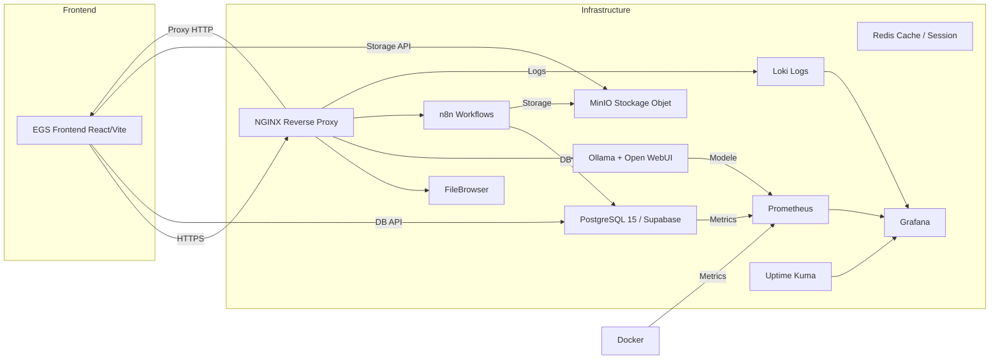
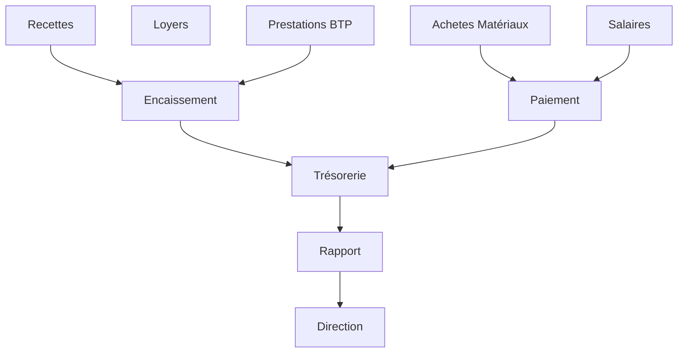

# EGS_SCHEMAS_VISUELS

## 1. Architecture générale



## 2. Schéma de données principal

```mermaid
erDiagram
  clients {
    uuid PK
    nom
    type
    email
    telephone
  }
  biens {
    uuid PK
    reference
    type
    statut
    adresse
    surface
  }
  contrats {
    uuid PK
    client_id FK
    bien_id FK
    date_debut
    date_fin
    montant
  }
  loyers {
    uuid PK
    contrat_id FK
    date_echeance
    montant
    statut
  }
  documents {
    uuid PK
    entite_type
    entite_id
    nom_fichier
    chemin
    version
    statut
  }
  lots {
    uuid PK
    reference
    localisation
    statut
    surface
  }
  attestations {
    uuid PK
    lot_id FK
    client_id FK
    date_emission
    statut
  }

  clients ||--o{ contrats : "signe"
  biens ||--o{ contrats : "est loue avec"
  contrats ||--o{ loyers : "genere"
  contrats ||--o{ documents : "contient"
  lots ||--o{ attestations : "attribue"
  clients ||--o{ attestations : "recoit"
  documents }o--|| clients : "referencie"
```

## 3. Module Immobilier

```text
[Bien Immobilier] --> [Contrat de Bail] --> [Locataire Client]
       |                         |
       |                         --> [Quittance / Reçu]
       --> [Document Technique]   --> [Paiement]
```

### Processus Immobilier
1. Enregistrer propriété
2. Créer contrat de bail
3. Générer quittance mensuelle
4. Encaisser paiement
5. Mettre à jour état locataire
6. Archiver document dans GED

## 4. Module Foncier

```text
[Région] --> [Commune] --> [Parcelle / Lot]
          --> [Dossier Administratif] --> [Attestation]
```

### Processus Foncier
- Réception dossier terrain
- Validation géographique et administrative
- Création lot foncier
- Émission attestation de cession
- Archivage et suivi conformité

## 5. Cycle Projet BTP

```text
[Prospection] -> [Etude / Chiffrage] -> [Planification]
      -> [Achat matières] -> [Exécution chantier] -> [Réception]
      -> [Facturation] -> [Clôture]
```

### Étapes clés
- Offre commerciale
- Validation contractuelle
- Commande fournisseurs
- Mise en chantier
- Réception provisoire
- Clôture définitive

## 6. Flux financier



## 7. Hiérarchie organisationnelle

```text
[Direction Générale]
     |
  +-- [Responsable Foncière]
  +-- [Responsable Immobilier]
  +-- [Responsable BTP]
  +-- [Responsable Finances]
  +-- [Responsable RH]
  +-- [Admin Système]
```

## 8. Audit trail et contrôle

```text
[Utilisateur] -> [Action ERP] -> [Table Audit]
      |                |
      |                --> [Événement]
      --> [Journal Système]
```

### Points de contrôle
- Sécurité : login, rôle, action
- Document : création, modification, suppression
- Flux financier : validation, approbation, clôture
- Historique : dates, utilisateur, statut
