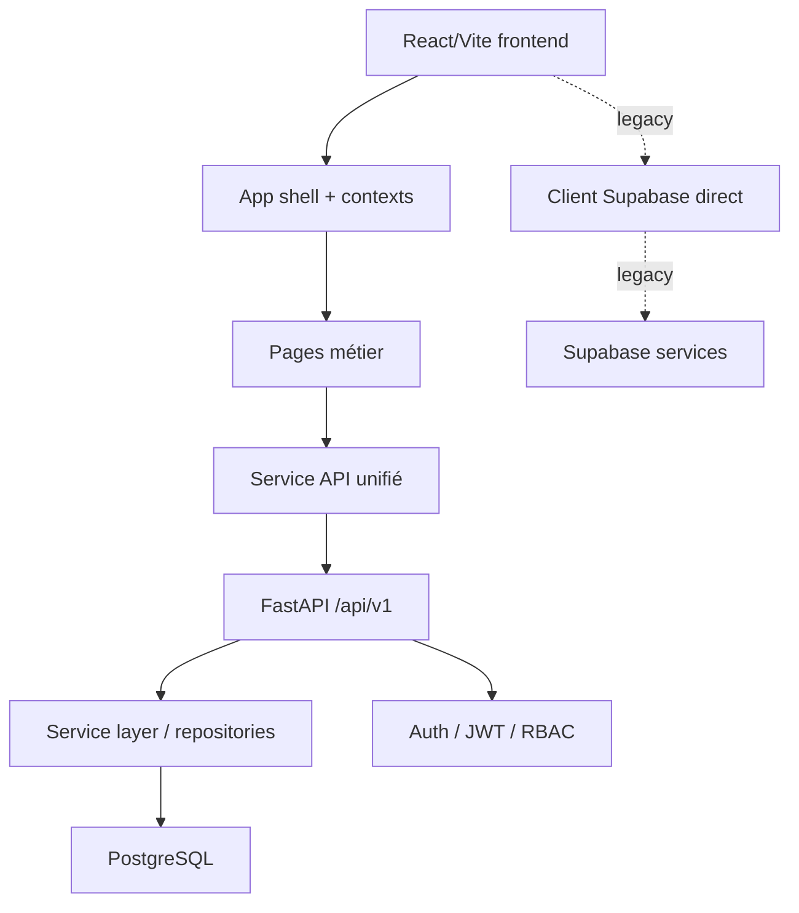

# Rapport d’unification architecturale EGS

## Statut

Ce document constitue la cartographie et l’audit de phase 0/1 du protocole de refactor. Aucune suppression n’a été effectuée : la priorité actuelle est la compréhension, la traçabilité et la validation avant toute consolidation destructive.

## 1. Cartographie complète

### 1.1 Frontend

- Framework principal : React 18 + TypeScript + Vite + Tailwind.
- Point d’entrée applicatif : [src/App.tsx](src/App.tsx)
- Navigation : état local dans l’application, sans routeur dédié.
- Contexte applicatif : [src/context/AuthContext.tsx](src/context/AuthContext.tsx), [src/context/SettingsContext.tsx](src/context/SettingsContext.tsx), [src/context/SiteContentContext.tsx](src/context/SiteContentContext.tsx).
- Pages métier : [src/pages](src/pages)
- Services API unifiés : [src/services/api/client.ts](src/services/api/client.ts)
- Intégration legacy Supabase : [src/lib/supabase.ts](src/lib/supabase.ts)

### 1.2 Backend

- Framework principal : FastAPI.
- Point d’entrée : [backend/app/main.py](backend/app/main.py)
- Configuration : [backend/app/core/config.py](backend/app/core/config.py)
- Base de données : [backend/app/core/database.py](backend/app/core/database.py)
- Routers versionnés : [backend/app/api/v1/**init**.py](backend/app/api/v1/__init__.py)
- Modules implémentés : auth, users, settings, media, projects, employees, suppliers, products, finance, immobilier, foncier.
- Référentiel SQLAlchemy : [backend/app/repositories](backend/app/repositories)

### 1.3 Base de données

- Système cible principal : PostgreSQL.
- Gouvernance de migrations : Alembic via [backend/alembic](backend/alembic)
- Modèles et seed initiaux : [backend/app/models](backend/app/models)
- Initialisation système : [backend/app/core/bootstrap.py](backend/app/core/bootstrap.py)

### 1.4 Docker et infrastructure

- Compose principal : [docker-compose.yml](docker-compose.yml)
- Compose backend : [backend/docker-compose.yml](backend/docker-compose.yml)
- Conteneurs/services observés : frontend web, production web, filebrowser.
- Déploiement CI/CD : [.github/workflows/deploy.yml](.github/workflows/deploy.yml)

### 1.5 Documentation et tests

- Documentation centrale : [README.md](README.md) et [backend/README.md](backend/README.md)
- Rapports d’architecture : [docs/architecture](docs/architecture)
- Tests backend : [backend/tests](backend/tests)
- Tests frontend : [src/lib/**tests**](src/lib/__tests__)

## 2. Diagramme logique

## 3. Architecture actuelle

### 3.1 État observé

- Le projet est encore hybride : le frontend utilise encore massivement le client Supabase direct dans de nombreuses pages et utilitaires, tandis que le backend expose déjà une couche FastAPI versionnée.
- L’authentification a commencé à migrer vers l’API locale via [src/services/api/client.ts](src/services/api/client.ts) et [src/context/AuthContext.tsx](src/context/AuthContext.tsx).
- Les modules métier sont en cours de couverture côté backend sous /api/v1, mais beaucoup de pages frontend restent dépendantes du modèle Supabase historique.

### 3.2 Architecture cible retenue

- Une seule API de référence : FastAPI versionnée sous /api/v1.
- Un frontend React consommant strictement cette API via un client unique.
- Une base PostgreSQL unique gouvernée par Alembic.
- Une seule source de vérité pour l’authentification, les modules métier, la configuration et les règles d’accès.

## 4. Forces

- Backend FastAPI déjà présent et fonctionnel.
- Documentation architecturale déjà existante et relativement détaillée.
- Service API front unifié déjà en place.
- Tests backend en place et stables.
- Base de migrations Alembic présente.

## 5. Faiblesses et risques

- Frontend encore fortement couplé à Supabase direct dans de nombreuses pages.
- Présence de routes et d’API parallèles : /api/auth et /api/v1/auth ; /api/users et /api/v1/users.
- Dépendance mixte entre architecture locale et logique legacy Supabase.
- Risque de divergence entre l’API backend et les écrans frontend tant que la migration n’est pas complète.
- Plusieurs fichiers de configuration et de déploiement coexistent, ce qui augmente la complexité opérationnelle.

## 6. Dette technique observée

- Doublons de surface API.
- Doublons de documents et scripts de déploiement.
- Coexistence de plusieurs chemins de configuration environnementale.
- Modules partiellement migrés côté frontend et backend.
- Dépendance à un client Supabase historique alors que le backend local est déjà disponible.

## 7. Duplications identifiées

- API redondantes : routes legacy et routes /api/v1.
- Documentation multiple sur l’architecture, la migration et le déploiement.
- Scripts de maintenance et d’ops redondants dans la racine.
- Plusieurs fichiers Docker Compose et variantes de déploiement.
- Modèles et services métier potentiellement dupliqués entre le frontend et le backend.

## 8. Modules et statut

### Modules déjà couverts côté backend

- Authentification
- Utilisateurs
- Paramètres
- Médias
- Projets
- Employés
- Fournisseurs
- Produits
- Finance
- Immobilier
- Foncier

### Modules encore à consolider

- Tâches
- Leads
- Documents
- Site vitrine
- Contact public
- Campagnes / notifications / workflow métier avancés

## 9. Endpoints API observés

### Backend existants

- /health
- /api/auth/\*
- /api/v1/auth/\*
- /api/users/\*
- /api/v1/users/\*
- /api/settings/\*
- /api/site-content/\*
- /api/media/\*
- /api/v1/projects/\*
- /api/v1/employees/\*
- /api/v1/suppliers/\*
- /api/v1/products/\*
- /api/v1/finance/\*
- /api/v1/immobilier/\*
- /api/v1/foncier/\*

## 10. Variables d’environnement et configuration

Fichiers et zones à surveiller :

- [/.env](.env)
- [/.env.example](.env.example)
- [/.env.local.example](.env.local.example)
- [/.env.server.example](.env.server.example)
- [backend/.env.example](backend/.env.example)

Les principales variables concernées sont liées à l’API locale, à Supabase, à PostgreSQL et à la sécurité JWT.

## 11. Validation actuelle

Validations déjà exécutées dans ce workspace :

- tests backend : pytest sur les suites auth, v1, media et modules métier
- état des routes backend : observé via la structure de [backend/app/api/v1/**init**.py](backend/app/api/v1/__init__.py)
- état du frontend : observé via [src/App.tsx](src/App.tsx) et [src/context/AuthContext.tsx](src/context/AuthContext.tsx)

## 12. Positionnement de la phase suivante

La phase suivante ne doit pas supprimer ni réécrire arbitrairement. Elle doit :

1. consolider les routes autour de /api/v1 uniquement ;
2. réduire la dépendance directe au client Supabase côté frontend ;
3. aligner les modules métier sur une seule source de vérité ;
4. valider chaque migration par tests avant toute suppression.

## 13. Recommandation de gouvernance

Avant toute suppression, exiger les points suivants :

- traçabilité de chaque dépendance ;
- validation par tests ;
- documentation synchronisée ;
- aucune route ou import abandonné sans remplacement explicite.
