# Inventaire et cartographie — Rapport initial

Résumé rapide

- Projet: EGS (Gnamba) — frontend React + TypeScript (Vite) avec backend Supabase.
- Nombre total de fichiers analysés: 186
- Orphelins détectés (approx.): 184 (analyse basée sur points d'entrée `src/main.tsx`, `src/App.tsx`)

Technologies principales

- Frontend: React 18, TypeScript, Vite, Tailwind CSS
- Auth/DB: Supabase (Postgres, Auth, Edge Functions)
- Push/Notifications: OneSignal (react-onesignal)
- Observabilité: Sentry (intégration), Cloudflare Insights (edge)
- Infra: nginx, docker-compose, Cloudflare (Workers / Pages)
- Tests: Vitest

Services & points d'intérêt

- Serveur statique / proxy: nginx configurations (nginx.conf, variants)
- Base de données et migrations: dossier `supabase/migrations/`
- Edge/Functions: `supabase/functions/` (Edge functions)
- Media & stockage: `src/components/media/`, `src/lib/mediaUtils.ts`
- Offline / sync engine: `src/offline/*` (connectivity, sync engine v2)

Duplicatas

- `reports/duplicates.json` est vide — aucun duplicata exact (SHA256) détecté.

Échantillon d'orphelins (10 premiers chemins détectés)

- src/components/AICopilot.tsx
- src/components/BrandLogo.tsx
- src/components/ErrorBoundary.tsx
- src/components/Layout.tsx
- src/components/NetworkStatus.tsx
- src/components/NotificationButton.tsx
- src/components/Sidebar.tsx
- src/components/dashboard/AlertsWidget.tsx
- src/components/dashboard/CategoryDonutChart.tsx
- src/components/dashboard/KPICard.tsx

Remarques sur l'analyse

- L'algorithme calcule la reachabilité depuis `src/main.tsx` et `src/App.tsx` ; beaucoup de fichiers sont marqués orphelins car l'analyse se base strictement sur imports statiques résolus localement. Les modules requis dynamiquement, tests, ou fichiers importés uniquement par des chemins non relatifs peuvent apparaître comme orphelins.
- Prochaine étape recommandée: affiner la résolution des imports dynamiques, inclure `package.json`/alias Vite, et produire `reports/orphans.json` filtré par type (tests, assets, pages publiques).

Graphe d'architecture (Mermaid)

```mermaid
flowchart LR
src_App_tsx["src/App.tsx"]
src_components_AICopilot_tsx["src/components/AICopilot.tsx"]
src_components_BrandLogo_tsx["src/components/BrandLogo.tsx"]
src_components_ErrorBoundary_tsx["src/components/ErrorBoundary.tsx"]
src_components_Layout_tsx["src/components/Layout.tsx"]
src_components_NetworkStatus_tsx["src/components/NetworkStatus.tsx"]
src_components_NotificationButton_tsx["src/components/NotificationButton.tsx"]
src_components_Sidebar_tsx["src/components/Sidebar.tsx"]
src_components_dashboard_AlertsWidget_ts["src/components/dashboard/AlertsWidget.tsx"]
src_components_dashboard_CategoryDonutCh["src/components/dashboard/CategoryDonutChart.tsx"]
src_components_dashboard_KPICard_tsx["src/components/dashboard/KPICard.tsx"]
src_components_dashboard_RevenueChart_ts["src/components/dashboard/RevenueChart.tsx"]
src_components_documents_DocumentForm_ts["src/components/documents/DocumentForm.tsx"]
src_components_filebrowser_FileBrowserIn["src/components/filebrowser/FileBrowserIntegration.tsx"]
src_components_filebrowser_FilebrowserIf["src/components/filebrowser/FilebrowserIframe.tsx"]
src_components_foncier_FoncierConstants_["src/components/foncier/FoncierConstants.ts"]
src_components_foncier_VillageLogoUpload["src/components/foncier/VillageLogoUploader.tsx"]
src_components_foncier_WorkflowValidatio["src/components/foncier/WorkflowValidation.tsx"]
src_components_media_BrandAssetsManager_["src/components/media/BrandAssetsManager.tsx"]
src_components_media_MediaCard_tsx["src/components/media/MediaCard.tsx"]
src_components_media_MediaDetailModal_ts["src/components/media/MediaDetailModal.tsx"]
src_components_media_MediaPicker_tsx["src/components/media/MediaPicker.tsx"]
src_components_media_MediaUploader_tsx["src/components/media/MediaUploader.tsx"]
src_components_media_SiteMediaAssignment["src/components/media/SiteMediaAssignments.tsx"]
src_components_page_builder_PageBuilder_["src/components/page-builder/PageBuilder.tsx"]
src_components_page_builder_PropertiesPa["src/components/page-builder/PropertiesPanel.tsx"]
src_components_page_builder_SectionPrevi["src/components/page-builder/SectionPreview.tsx"]
src_components_page_builder_types_ts["src/components/page-builder/types.ts"]
src_components_public_PublicFooter_tsx["src/components/public/PublicFooter.tsx"]
src_components_public_PublicLayout_tsx["src/components/public/PublicLayout.tsx"]
src_components_public_PublicNavbar_tsx["src/components/public/PublicNavbar.tsx"]
src_components_public_PublicPageLayoutRe["src/components/public/PublicPageLayoutRenderer.tsx"]
src_components_public_PublicSocialWall_t["src/components/public/PublicSocialWall.tsx"]
src_components_ui_Badge_tsx["src/components/ui/Badge.tsx"]
src_components_ui_Breadcrumb_tsx["src/components/ui/Breadcrumb.tsx"]
src_components_ui_Input_tsx["src/components/ui/Input.tsx"]
src_components_ui_LazyImage_tsx["src/components/ui/LazyImage.tsx"]
src_components_ui_MobileCard_tsx["src/components/ui/MobileCard.tsx"]
src_components_ui_Modal_tsx["src/components/ui/Modal.tsx"]
src_components_ui_SafeImage_tsx["src/components/ui/SafeImage.tsx"]
src_components_ui_SyncRemoteButton_tsx["src/components/ui/SyncRemoteButton.tsx"]
src_components_ui_Toast_tsx["src/components/ui/Toast.tsx"]
src_context_AuthContext_tsx["src/context/AuthContext.tsx"]
src_context_NotificationContext_tsx["src/context/NotificationContext.tsx"]
src_context_SettingsContext_tsx["src/context/SettingsContext.tsx"]
src_context_SiteContentContext_tsx["src/context/SiteContentContext.tsx"]
src_contexts_VillageContext_tsx["src/contexts/VillageContext.tsx"]
src_data_client_ts["src/data/client.ts"]
src_lib_supabase_ts["src/lib/supabase.ts"]
src_main_tsx["src/main.tsx"]
```

Fichiers utiles:

- Graphe complet: [reports/repo-graph.mmd](reports/repo-graph.mmd)
- Détails des nœuds: [reports/repo-nodes.json](reports/repo-nodes.json)
- Résumé chiffré: [reports/repo-summary.json](reports/repo-summary.json)
- Duplicatas: [reports/duplicates.json](reports/duplicates.json)

Prochaine étape proposée

- Affiner la détection des orphelins (inclure alias Vite, imports dynamiques), produire `reports/orphans.json` filtré et `reports/inventory.md` détaillé.
